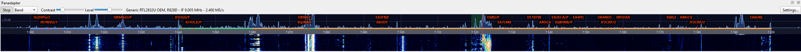
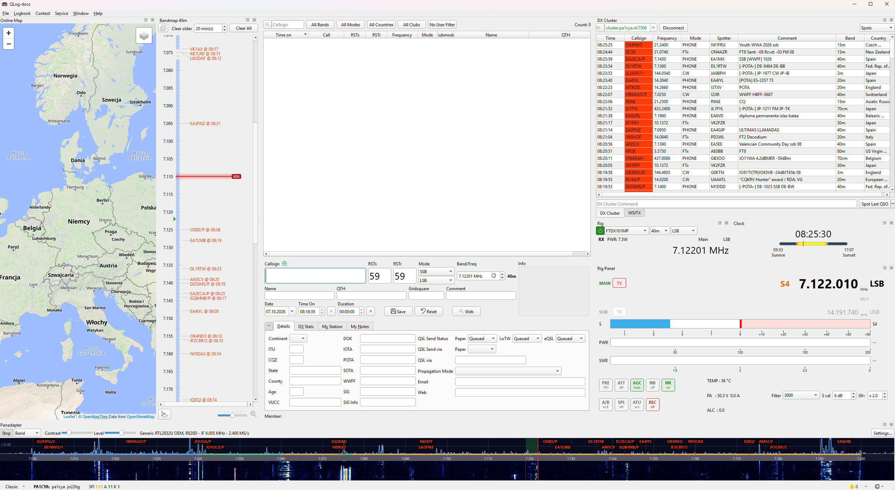
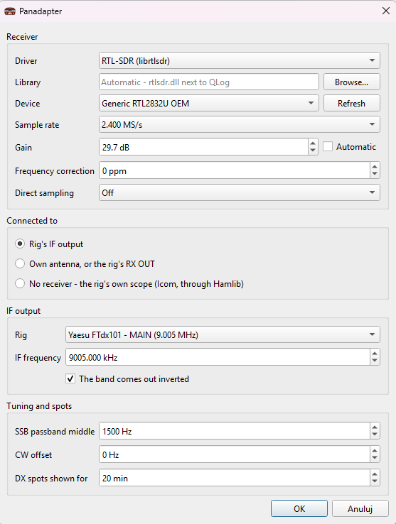
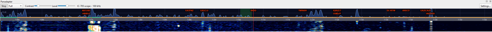
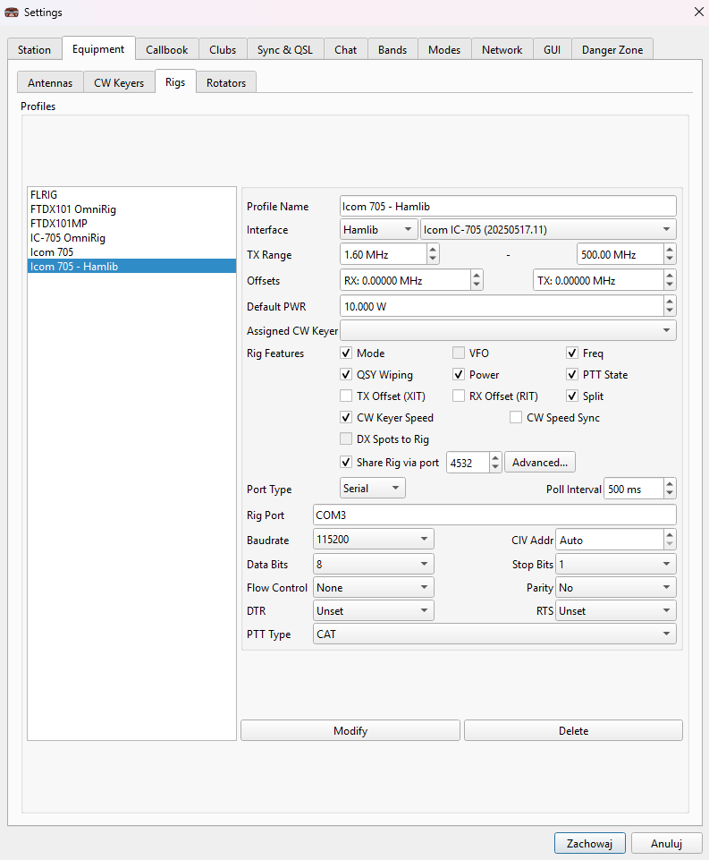
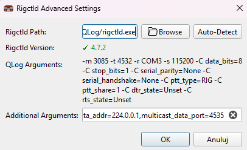
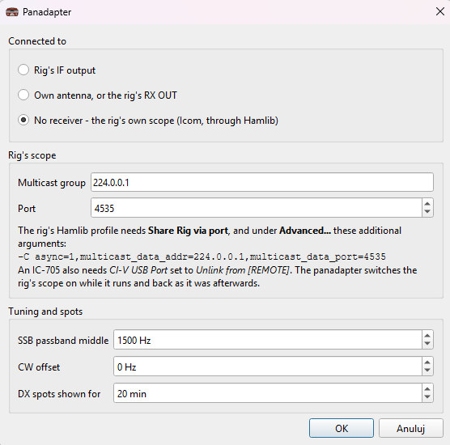
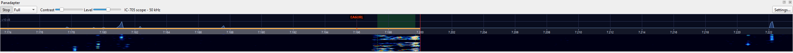
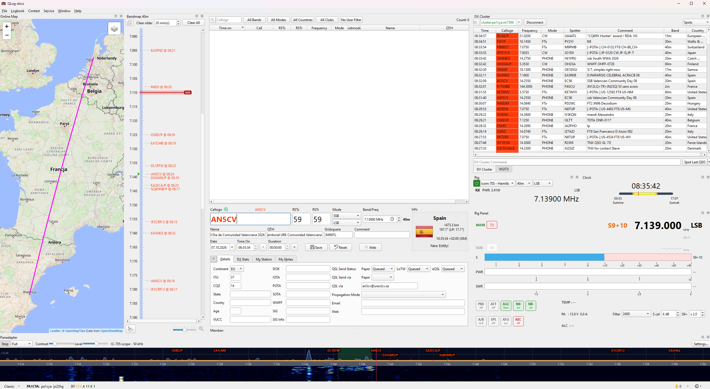

# Panadapter

The Panadapter shows the band around the rig as a spectrum and a waterfall. DX cluster spots appear over their signals, and a click on a signal tunes the rig to it.

Open it from **Window → Panadapter**, choose the source in **Settings...** and press **Start**.





## Where the picture comes from

| Source | For | What you need |
|---|---|---|
| **Rig's IF output** | rigs with an IF OUT socket (FTdx101) | an RTL-SDR dongle on the IF OUT socket |
| **Own antenna, or the rig's RX OUT** | any rig | an RTL-SDR dongle on a receive antenna or the rig's RX OUT |
| **No receiver – the rig's own scope** | IC-705, IC-7300, IC-9700, IC-7610 and similar Icoms | nothing extra, it comes through Hamlib |

### RTL-SDR

- Use an RTL-SDR dongle, preferably the **RTL-SDR Blog V4**, with the WinUSB driver installed by Zadig. `rtlsdr.dll` is included in the package.
- **Behind the IF output** the dongle stays on the rig's IF frequency, and the picture follows the VFO by itself. A preset is included for the FTdx101 (MAIN 9.005 MHz, SUB 8.900 MHz, both inverted). For other rigs, enter the IF frequency.
- **On an antenna or RX OUT** the dongle receives real frequencies and is retuned to follow the rig.

> **Warning:** a dongle on an antenna is not protected from your transmitter. A shared antenna through a splitter, or a receive antenna close to the transmitting one, destroys the dongle at 100 W. Use a T/R switch, or an RX OUT socket that the rig mutes while transmitting, and try first on a dummy load at low power.



| Setting | Meaning |
|---|---|
| Driver, Library | RTL-SDR via librtlsdr. Leave Library on Automatic to use `rtlsdr.dll` next to QLog. |
| Device | The dongle; **Refresh** looks for it again |
| Sample rate | How much band the dongle sees; 2.4 MS/s gives about ±1 MHz |
| Gain | Receiver gain, or **Automatic** |
| Frequency correction | Dongle error in ppm (antenna mode) |
| Direct sampling | Off for a normal dongle |
| IF output | Rig preset, the IF frequency, and whether the band comes out inverted |

### The rig's own scope (Icom through Hamlib)

Icom rigs send their scope over CI-V. Hamlib's rigctld, which QLog starts for itself, passes it on to the panadapter. This does **not** work through OmniRig.



1. **On the rig (IC-705):** MENU → SET → Connectors → CI-V. Set **CI-V USB Port** to *Unlink from [REMOTE]* and **CI-V USB Baud Rate** to *115200*.
2. **Rig profile in QLog:** use **Hamlib**, tick **Share Rig via port**, and under **Advanced...** add these arguments on one line:
   ```
   -C async=1,multicast_data_addr=224.0.0.1,multicast_data_port=4535
   ```
   
   
3. **Panadapter → Settings...:** choose **No receiver – the rig's own scope**.



**Notes on the rig's scope:**
- The panadapter switches the rig's scope on while it runs, and puts it back when it stops or the rig disconnects.
- When the rig is disconnected, the scope stops with it. It starts again by itself about 5 seconds after a Hamlib rig reconnects.
- Set the span **on the rig**, and choose **Full** in the panadapter. It then shows exactly what the rig sends.
- The rig always sends 475 points. At ±100 kHz CW signals merge, so use ±5 or ±10 kHz for CW.
- In the first seconds after connecting, rigctld may reject commands while the scope stream starts.
- On Windows a network connection must be up (Wi-Fi or cable). Internet access is not needed.

Rigs whose scope Hamlib 4.7.2 can pass on: IC-7300, IC-7300MK2, IC-705 (tested), IC-9700, IC-7610, IC-7850/7851, IC-R8600, IC-905. Yaesu and Kenwood rigs do not send their scope over CAT; use an RTL-SDR behind IF / RX OUT instead.





## Using it

| Action | Result |
|---|---|
| Click on a signal | Tunes the rig. In SSB and AM the click is the carrier, as on a rig's touch scope. In CW and data modes it puts the signal in the middle of the passband. |
| Click on a spot label | Tunes to the spot, as in the bandmap |
| Mouse wheel | Tunes in 100 Hz steps (10 Hz in CW and data) |
| Ctrl + wheel | Zoom |
| Shift + wheel, or drag | Moves the picture |
| Double-click | Back to the rig's frequency |

**Toolbar**

| Control | Meaning |
|---|---|
| Start / Stop | Starts or stops the receiver |
| Span | ±5 to ±500 kHz, **Full** (all the receiver sees) or **Band** (the whole amateur band) |
| Contrast | How many dB the colours span |
| Level | Where the colours start against the noise |
| Text next to the sliders | The source, e.g. the dongle and IF frequency, or "IC-705 scope - 50 kHz" |

**Picture**
- The scale shows the IARU Region 1 band plan: CW, digital and phone segments are coloured.
- The green band is the rig's receive passband.
- While transmitting, the waterfall and noise floor are held.

**Settings shared by all sources**

| Setting | Meaning |
|---|---|
| SSB passband middle | How far the middle of an SSB passband is from the displayed frequency (up in USB, down in LSB); used for the shaded passband and for clicks on signals |
| CW offset | The same for CW; 0 when the rig displays the frequency of the signal it is tuned to |
| DX spots shown for | How long a spot stays on the picture; 0 hides spots |
