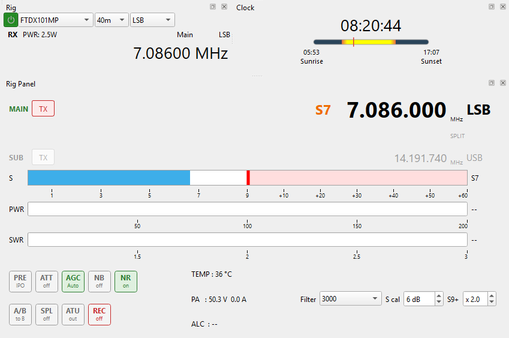
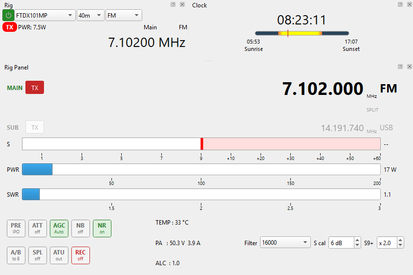
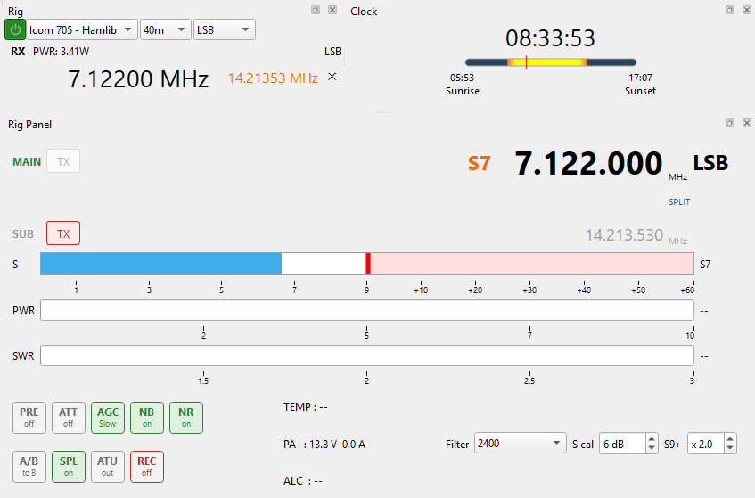
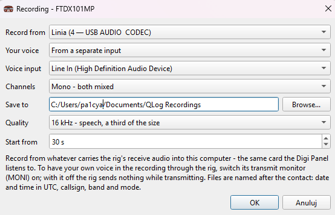

# Rig Panel

> **Under active development.** The Rig Panel is new and still changing. It may be unstable with some rigs or drivers. Keep a backup of your log, and report problems in [Issues](https://github.com/SebaBecks/QLog-Extras/issues).

The Rig Panel is a dock that shows more of the rig than QLog's own Rig window: both VFOs, the S meter, power, SWR and ALC. It also has buttons for the receiver settings and records QSO audio.

Open it from **Window → Rig Panel**.

## Where the readings come from

The panel reads frequency, mode, VFO, split and PTT from QLog itself, so these work with every rig driver. The meters and buttons need a second link to the rig:

| Rig profile in QLog | Meters and buttons |
|---|---|
| **Hamlib** with **Share Rig via port** ticked | All of them, read from QLog's own rigctld |
| **Omnirig** / **Omnirig v2** | S meter, PWR, SWR, ALC, PRE, ATT, AGC, NB, NR, SPL (see [OmniRig](omnirig.md)) |
| Any other driver | Frequency, mode and VFOs only |

## The display

**VFO rows**
- The VFO the rig receives on is shown large, with its mode. The other VFO is grey.
- The rows are named the way the rig names them: **MAIN / SUB** on rigs with a second receiver (FTdx101, IC-7610), **VFO A / VFO B** on the others.
- A rig with one receiver (IC-705, IC-7300, FTdx10, TS-590 …) shows the other VFO only in split, like the rig itself.
- **TX** marks the VFO that transmits. It is outlined while receiving and filled red while transmitting. In split it moves to the other VFO, and **SPLIT** turns blue.

**S meter**
- The bar is white up to S9 and pink above it, with a red line at S9.
- The reading is also shown in orange next to the frequency.
- During transmission the S meter is blanked.

**PWR** and **SWR** (filled while transmitting)

- PWR is in watts. The scale follows **Default PWR** in the rig profile, so set that to your rig's full power. Below 20 W one decimal is shown.
- SWR runs from 1 to 3 and turns red from 2.

**Other readings**

| Field | Meaning |
|---|---|
| TEMP | PA temperature, where the rig reports it |
| PA | supply voltage and current |
| ALC | ALC level while transmitting |
| Filter | the receive bandwidth the rig reports (display only) |
| S cal | moves the S meter up or down in dB, if it reads differently from the rig's own meter |
| S9+ | stretches the part above S9 |

**S cal** and **S9+** are kept separately for each rig profile.

## Buttons

Each button shows its current setting under its name. A click changes the setting on the rig, and the panel then reads it back, so it always shows what the rig really did. A change made with a knob on the rig shows within a few seconds.

| Button | What it does |
|---|---|
| **PRE** | Preamp, stepping through the rig's own settings (e.g. IPO / AMP1 / AMP2 on a Yaesu, off / AMP1 / AMP2 on an Icom) |
| **ATT** | Attenuator, stepping through the rig's settings (e.g. off / 6 / 12 / 18 dB, or off / 20 dB on an IC-705) |
| **AGC** | AGC speed: Fast → Med → Slow (→ Auto where the rig has it) |
| **NB** | Noise blanker on / off |
| **NR** | Noise reduction on / off |
| **A/B** | Moves the rig to the other VFO. In split the receive and transmit rows swap, as on the rig. Hamlib only. |
| **SPL** | Split on / off. The rig transmits on the VFO it is not receiving on. |
| **ATU** | Antenna tuner in / out. Hamlib only. |
| **REC** | Starts and stops recording; right-click for the settings and the recordings folder |

With Hamlib, the PRE, ATT and AGC steps come from Hamlib's description of your rig model.

## Split

With split on, the receiving VFO is shown large and the transmitting VFO carries the TX tag.

On an Icom through Hamlib, both frequencies are read directly from rigctld. QLog's own Rig window may show the transmit frequency in split. That is a Hamlib 4.7.2 issue, not this panel.

## Recording (REC)

Press **REC** to record the QSO audio to a WAV file. The panel always keeps the last seconds in memory, so pressing REC in the middle of a QSO still catches its start.

Each file is named after the contact: date and time in UTC, callsign, band and mode.

Right-click **REC** → **Recording settings...**:

| Setting | Meaning |
|---|---|
| Record from | The sound card that carries the rig's receive audio (e.g. the rig's USB audio CODEC) |
| Your voice | **Through the rig**: switch the rig's transmit monitor (MONI) on. **From a separate input**: e.g. the monitor output of a microphone equaliser; it is added only while transmitting. |
| Voice input | The sound card of the separate input |
| Channels | **Stereo**: the other station left, you right. **Mono**: both mixed. |
| Save to | Folder for the recordings |
| Quality | 16 kHz (speech, smaller files) or 48 kHz (wide AM and FM) |
| Start from | How many seconds before the press go into the file (30 s by default) |

The sound cards, the voice source and stereo/mono are kept for each rig profile.

## Known limitations

- Hamlib's preamp and attenuator values are used as Hamlib describes them; a few rigs may name them differently from their front panel.
- On an Icom through Hamlib the other VFO is not read outside split. Hamlib 4.7.2 mixes the VFOs up when it is.
- The IC-705 does not report which VFO is active. The panel assumes VFO A when it connects and follows its own A/B presses after that.
